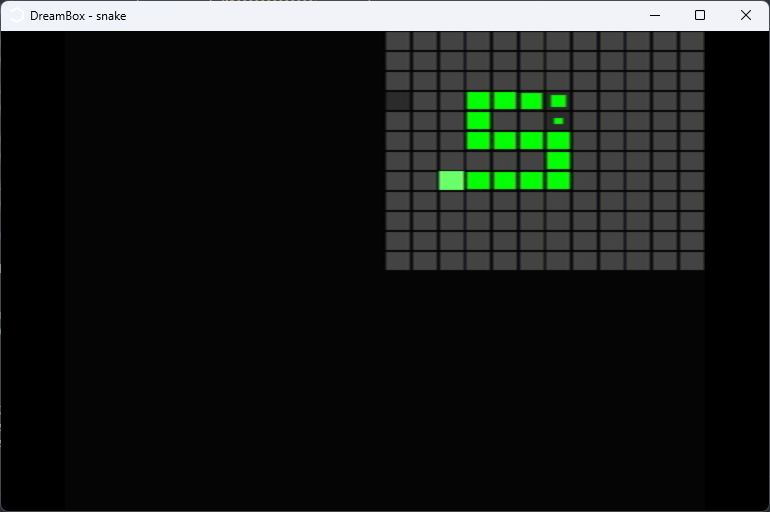

# Snake for [DreamBox 3D](https://dreambox3d.dev/)

Made this for a class at university, so there's no plans to update this at all.

I cleaned up some of the code and tried to add comments so if anyone wants to work with DreamBox themselves they can reference this.

## Some useful bits of code

### Apply camera/perspective transformation to tris

`draw.rs > transform_draw_tris`

For example, this is a screenshot of the game that only draws the tris, instead of transforming them first.

For this game specifically, the tris for the game grid are drawn between `(0,0,0)` and `(1,1,0)` and the transformations applied are based on that, which is why everything appears in the top right quadrant. For more typical 3d games, the perspective projection will be the same but the rotation/scale/position will have to be adapted.

### RNG

`rng.rs`

DreamBox, like most consoles from the era, has no RNG functionality built in. [With help from Retro Game Mecahnics Explained](https://youtu.be/q15yNrJHOak?t=292), I was able to port the math from Super Mario 64.

### Apply a deadzone radius to your controller input

`util.rs > read_deadzone`
